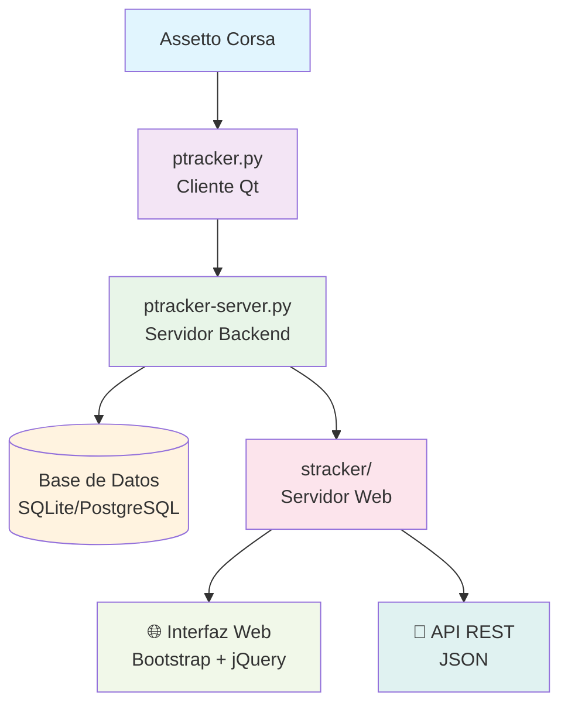
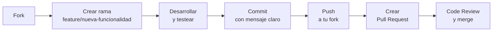

# SPTracker

<div align="center">


**SPTracker** es una solución avanzada para la gestión y análisis de carreras en Assetto Corsa. Incluye un plugin cliente, servidor de telemetría, interfaz web y soporte para base de datos, permitiendo monitoreo en tiempo real, estadísticas y administración centralizada.

[](https://github.com/rodrigoangeloni/sptracker-original-3.5.1/actions)
[](https://github.com/rodrigoangeloni/sptracker-original-3.5.1/branches)
[](https://www.python.org/)
[](https://pyside.org/)
[](https://cherrypy.org/)
[](https://www.sqlite.org/)
[](https://www.postgresql.org/)
[](LICENSE.txt)

[](https://github.com/rodrigoangeloni/sptracker-original-3.5.1/branches)
[](https://github.com/rodrigoangeloni/sptracker-original-3.5.1/commits)
[](https://github.com/rodrigoangeloni/sptracker-original-3.5.1)

[📖 Documentación](docs/) • [🚀 Inicio Rápido](#inicio-rápido) • [📋 Issues](https://github.com/rodrigoangeloni/sptracker-original-3.5.1/issues) • [💬 Discusiones](https://github.com/rodrigoangeloni/sptracker-original-3.5.1/discussions)

</div>

---

## ✨ Características principales

<div align="center">

| 🚗 **Cliente Assetto Corsa** | 🖥️ **Servidor Telemetría** | 🌐 **Interfaz Web** | 🗄️ **Base de Datos** |
|:----------------------------:|:--------------------------:|:-------------------:|:--------------------:|
| Plugin integrado en AC      | Procesamiento en tiempo real | Panel administrativo | SQLite/PostgreSQL   |
| Interfaz Qt moderna         | Comunicación TCP/IP       | Mapas en vivo       | Estadísticas completas |
| Telemetría detallada        | Gestión de sesiones       | API REST            | Backup automático    |

</div>

### 🎯 Funcionalidades destacadas

- **📊 Telemetría en tiempo real**: Seguimiento preciso de posiciones, velocidades y tiempos
- **🏁 Gestión de carreras**: Sesiones, clasificaciones y estadísticas automáticas
- **🗺️ Mapas interactivos**: Visualización en vivo de posiciones en circuito
- **👥 Multi-jugador**: Soporte completo para servidores dedicados
- **🔧 Configuración flexible**: Más de 50 opciones de personalización
- **📱 API REST**: Integración con sistemas externos
- **🔒 Seguridad**: Autenticación, permisos y validación de datos
- **📈 Rendimiento**: Optimizado para alta concurrencia

---

## 🚀 Inicio rápido

### 📦 Instalación

#### Opción 1: Instalador automático (Recomendado)
```bash
# Descargar desde releases
# Ejecutar ptracker-V3.5.1.exe
# Seguir el asistente de instalación
```

#### Opción 2: Instalación manual
```bash
# Clonar repositorio
git clone https://github.com/rodrigoangeloni/sptracker-original-3.5.1.git
cd sptracker-original-3.5.1

# Instalar dependencias
pip install -r requirements.txt
pip install PySide6 psycopg2-binary

# Configurar
cp stracker/stracker.ini.example stracker/stracker.ini
```

### ⚙️ Configuración básica

1. **Assetto Corsa**:
   ```bash
   # Copiar plugin
   cp -r ptracker/ "C:/Program Files/Assetto Corsa/apps/python/"
   ```

2. **Servidor**:
   ```ini
   # stracker/stracker.ini
   [STRACKER_CONFIG]
   listening_port = 50000

   [HTTP_CONFIG]
   listen_port = 8080
   admin_username = admin
   admin_password = tu_password_seguro
   ```

3. **Base de datos** (opcional):
   ```ini
   [DATABASE]
   database_type = postgres
   postgres_host = localhost
   postgres_user = sptracker
   postgres_db = sptracker_db
   ```

### 🎮 Primer uso

```bash
# Iniciar servidor
python stracker/stracker.py

# Acceder a la interfaz web
# http://localhost:8080
# Usuario: admin / Contraseña: [tu_password]
```

---

## 📚 Documentación

<div align="center">

### 📖 Guías principales

| Documento | Descripción | Dificultad |
|:----------|:------------|:----------:|
| [**🏗️ Arquitectura**](docs/ARCHITECTURE.md) | Componentes y flujo de datos | Intermedio |
| [**⚙️ Configuración**](docs/CONFIGURATION.md) | Todas las opciones disponibles | Todos |
| [**📚 Módulos**](docs/MODULES.md) | Referencia de APIs y bibliotecas | Avanzado |
| [**🔌 API REST**](docs/API.md) | Integración programática | Avanzado |
| [**💻 Desarrollo**](docs/DEVELOPMENT.md) | Contribuir al proyecto | Avanzado |
| [**🔧 Troubleshooting**](docs/TROUBLESHOOTING.md) | Solución de problemas | Todos |

### 📋 Documentos adicionales

- [**📄 README.txt**](README.txt) - Información histórica
- [**📝 TODO.txt**](TODO.txt) - Roadmap y tareas pendientes
- [**⚖️ LICENSE.txt**](LICENSE.txt) - Términos de uso

</div>

---

## 🏗️ Arquitectura del sistema



### 🧩 Componentes principales

- **🚗 Cliente**: Plugin Qt para Assetto Corsa
- **🖥️ Servidor**: Procesamiento de telemetría y datos
- **🌐 Web**: Interfaz de administración y visualización
- **🗄️ Base de datos**: Almacenamiento persistente
- **📡 API**: Integración con sistemas externos

---

## 🛠️ Tecnologías utilizadas

<div align="center">

### Backend & Core


### Base de datos


### Frontend & UI


### Desarrollo & Build


</div>

---

## 📊 Estructura del proyecto

```
sptracker-original-3.5.1/
├── 📁 ptracker/                 # 🏁 Cliente Assetto Corsa
│   ├── ptracker.py              # 🚗 Plugin principal
│   └── 📁 data/                 # 📊 Datos del plugin
├── 📁 ptracker_lib/             # 🧰 Biblioteca central (30+ módulos)
│   ├── client_server/          # 🔌 Protocolo comunicación
│   ├── database.py              # 🗄️ Abstracción BD
│   ├── ac_logparser.py          # 📝 Parser logs AC
│   ├── lap_collector.py         # ⏱️ Gestión tiempos
│   └── ...
├── 📁 stracker/                 # 🌐 Servidor web
│   ├── stracker.py              # 🖥️ Servidor principal
│   ├── 📁 stracker_lib/         # 🛠️ Utilidades web
│   ├── 📁 http_templates/       # 📄 Templates HTML
│   └── 📁 http_static/          # 🎨 Recursos web
├── 📁 docs/                     # 📚 Documentación completa
│   ├── ARCHITECTURE.md          # 🏗️ Arquitectura
│   ├── CONFIGURATION.md         # ⚙️ Configuración
│   ├── API.md                   # 🔌 API REST
│   └── ...
├── 📁 images/                   # 🖼️ Recursos gráficos
├── 📁 sounds/                   # 🔊 Efectos de audio
├── 📁 versions/                 # 📦 Releases generados
├── 📄 requirements.txt          # 📋 Dependencias
├── 🛠️ create_release.py         # 📦 Script de build
├── 📄 ptracker.nsh.in           # 📦 Template NSIS
├── 📄 README.md                 # 📖 Este archivo
└── 📄 LICENSE.txt               # ⚖️ Licencia
```

---

## 🤝 Contribuir

<div align="center">

¡Las contribuciones son bienvenidas! 👋

[](docs/DEVELOPMENT.md)
[](docs/DEVELOPMENT.md)

</div>

### 🚀 Flujo de contribución



### 🎯 Tipos de contribución

| Tipo | Descripción | Ejemplo |
|:-----|:------------|:--------|
| 🐛 **Bug fixes** | Corrección de errores | Fix crash on startup |
| ✨ **Features** | Nuevas funcionalidades | Add weather data export |
| 📚 **Documentation** | Mejoras en docs | Update API examples |
| 🧪 **Tests** | Cobertura adicional | Add unit tests for lap_collector |
| ⚡ **Performance** | Optimizaciones | Improve database queries |
| 🔄 **Refactoring** | Mejora de código | Clean up configuration parsing |

### 📝 Convenciones de commit

```
feat: añadir nueva funcionalidad de chat
fix: corregir cálculo de tiempos de vuelta
docs: actualizar guía de configuración
test: añadir tests para validador de vueltas
perf: optimizar queries de estadísticas
refactor: reestructurar módulo de comunicación
```

---

## 🆘 Soporte

<div align="center">

### 📞 Canales de soporte

| Canal | Uso | Enlace |
|:------|:----|:-------|
| 📋 **Issues** | Bugs y features | [GitHub Issues](https://github.com/rodrigoangeloni/sptracker-original-3.5.1/issues) |
| 💬 **Discussions** | Preguntas generales | [GitHub Discussions](https://github.com/rodrigoangeloni/sptracker-original-3.5.1/discussions) |
| 📖 **Wiki** | Guías comunitarias | [GitHub Wiki](https://github.com/rodrigoangeloni/sptracker-original-3.5.1/wiki) |
| 🐛 **Debugging** | Troubleshooting | [Guía de resolución](docs/TROUBLESHOOTING.md) |

</div>

### 🐛 Reportar problemas

Para reportes efectivos incluir:

```markdown
**Versión**: 3.5.1
**SO**: Windows 10 Pro 22H2
**Python**: 3.11.8
**Descripción**: [Descripción clara del problema]
**Pasos para reproducir**:
1. [Paso 1]
2. [Paso 2]
3. [Resultado esperado vs actual]
**Logs**: [Adjuntar logs relevantes]
**Configuración**: [Secciones relevantes de stracker.ini]
```

---

## 📈 Estado del proyecto

<div align="center">

### ✅ Funcionalidades completas

| Categoría | Estado | Detalles |
|:----------|:-------|:---------|
| **Cliente Assetto Corsa** | ✅ Completo | Plugin Qt con telemetría completa |
| **Servidor Backend** | ✅ Completo | Procesamiento en tiempo real |
| **Interfaz Web** | ✅ Completo | Panel admin + mapas en vivo |
| **Base de Datos** | ✅ Completo | SQLite + PostgreSQL |
| **Instalador** | ✅ Completo | NSIS automatizado |
| **API REST** | ✅ Completo | Integración externa |

### 🚧 En desarrollo

| Feature | Estado | Prioridad |
|:--------|:-------|:----------|
| Tests automatizados | 🔄 En progreso | Alta |
| Docker support | 📋 Planificado | Media |
| Clustering | 📋 Planificado | Media |
| Sistema de plugins | 📋 Planificado | Baja |

### 📊 Métricas del proyecto

[](https://github.com/rodrigoangeloni/sptracker-original-3.5.1)
[](https://github.com/rodrigoangeloni/sptracker-original-3.5.1)
[](ptracker_lib/)

</div>

---

## 👥 Créditos y licencia

<div align="center">

**Desarrollado por [Rodrigo Angeloni](https://github.com/rodrigoangeloni)**

### 🙏 Agradecimientos

- **🎮 Comunidad Assetto Corsa** - Por el feedback y testing continuo
- **🏎️ Kunos Simulazioni** - Por crear Assetto Corsa
- **🐍 Comunidad Python** - Por las excelentes librerías
- **🔧 Contribuidores** - Por mejoras y correcciones

### 📄 Licencia

Este proyecto está bajo la **Licencia MIT**.
Ver [`LICENSE.txt`](LICENSE.txt) para detalles completos.

[](LICENSE.txt)

</div>

---

## 📋 Roadmap

Ver [`TODO.txt`](TODO.txt) para el roadmap completo y tareas pendientes.

### 🎯 Próximas versiones

- **v3.5.3**: Mejoras de rendimiento y estabilidad (actual)
- **v3.6.0**: Sistema de plugins extensible
- **v4.0.0**: Arquitectura completamente modular

---

<div align="center">

**⭐ Si te gusta SPTracker, ¡dale una estrella en GitHub!**

[📖 **Documentación completa**](docs/) • [🚀 **Descargar última versión**](https://github.com/rodrigoangeloni/sptracker-original-3.5.1/releases) • [🐛 **Reportar issue**](https://github.com/rodrigoangeloni/sptracker-original-3.5.1/issues)

---

*SPTracker - Gestión profesional de carreras para Assetto Corsa*

</div>


